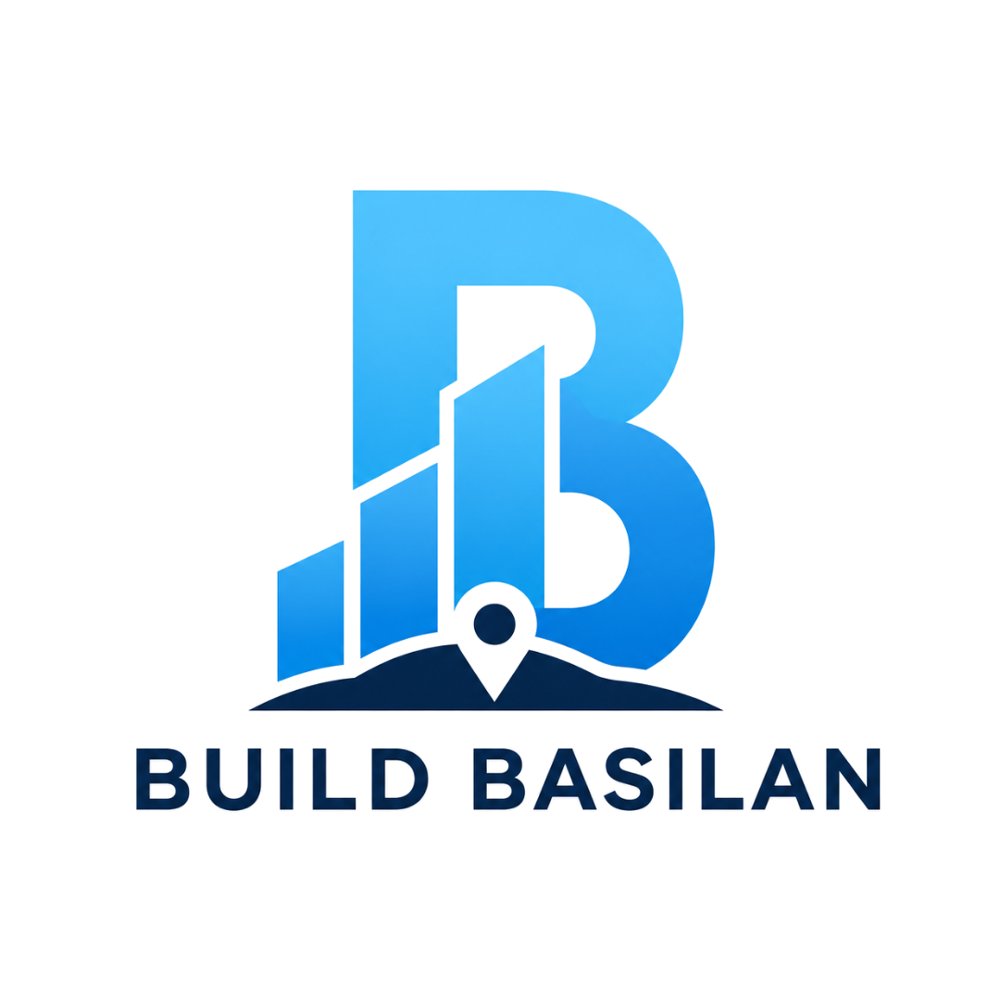

# 💙 Build Basilan

### **Building a Better Basilan, One Website at a Time.**

A community initiative empowering NGOs, youth organizations, and community groups in Basilan through meaningful technology.

  <a href="https://build-basilan.online"><strong>🌐 Website</strong></a> •
  <a href="https://forms.gle/9nweWPH4JneA5NjQ6"><strong>📝 Apply</strong></a> •
  <a href="https://www.facebook.com/jaymar.maruji"><strong>📘 Facebook</strong></a>

---

# 🌱 About Build Basilan

Build Basilan is a community initiative founded by **Jaymar Maruji**, a Computer Science student and solo developer from Basilan.

The initiative was born from one simple question:

> **"As a Computer Science student from Basilan and a solo developer, how can I give back to the place I call home?"**

Many organizations in Basilan are already creating meaningful change. They empower young people, serve communities, protect the environment, and inspire others every day.

Yet many of them remain difficult to discover online.

Build Basilan exists to change that.

By building modern, accessible, and impactful websites, we help organizations strengthen their digital presence, tell their stories, connect with more people, and amplify the work they are already doing.

This is not just about websites.

It's about creating opportunities through technology.

---

# 🎯 Our Mission

To empower NGOs, youth organizations, and community groups in Basilan by building meaningful digital solutions that strengthen their online presence, amplify their mission, and help them create greater impact within and beyond their communities.

---

# 🌍 Our Vision

To build a digitally empowered Basilan where every organization has the opportunity to be discovered, inspire more people, and create lasting change through accessible technology.

---

# 💙 Why Build Basilan?

Technology has transformed the way people connect, learn, and create opportunities.

Unfortunately, many community organizations still rely only on social media to tell their stories.

While social media is powerful, it is temporary.

Websites create credibility.

They preserve stories.

They help organizations reach volunteers, partners, donors, and communities that may never have discovered them otherwise.

Build Basilan was created to bridge that gap.

One organization.

One website.

One community at a time.

---

# 🌟 What We Believe

✅ Every mission deserves to be seen.

✅ Technology should help communities, not only businesses.

✅ Great organizations deserve a professional online presence.

✅ Small actions can create lasting impact.

✅ Building communities begins with collaboration.

---

# 🚀 What We Do

Build Basilan helps organizations by providing:

- 🌐 Modern websites
- 📱 Mobile-first responsive design
- ⚡ Fast performance
- 🔍 Basic SEO optimization
- ♿ Accessible user experience
- 🎨 Professional UI/UX Design
- 📖 Story-driven content presentation
- 📩 Contact & inquiry forms
- 📸 Gallery and project showcase
- 🤝 Volunteer and partnership pages

---

# 🔄 How It Works

### 1️⃣ Application

Organizations submit an online application through the Build Basilan website.

↓

### 2️⃣ Review

Applications are evaluated using a transparent selection process.

↓

### 3️⃣ Collaboration

We work closely with the selected organization to understand their mission and goals.

↓

### 4️⃣ Development

A modern, responsive website is designed and developed.

↓

### 5️⃣ Launch

The website is published and officially becomes part of the Build Basilan Impact Network.

---

# 📊 Selection Criteria

Every application is evaluated fairly using the following criteria.

| Criteria | Weight |
|----------|--------:|
| Community Impact | 30% |
| Need for Digital Presence | 25% |
| Readiness to Collaborate | 20% |
| Long-term Value | 15% |
| Alignment with Build Basilan | 10% |

**Total: 100%**

---

# 🛠 Tech Stack

| Technology | Purpose |
|------------|---------|
| Next.js | Framework |
| React | UI Library |
| TypeScript | Type Safety |
| Tailwind CSS | Styling |
| shadcn/ui | Components |
| Framer Motion | Animations |
| Lucide React | Icons |
| Vercel | Deployment |

---

# 🗺 Roadmap

## 2026

- ✅ Launch Build Basilan
- ✅ Publish official website
- ✅ Open applications
- ⏳ Select first partner organization
- ⏳ Build Project #001
- ⏳ Launch first website

---

## Future

- Support one organization every month
- Build the Build Basilan Impact Network
- Launch Organization Directory
- Recruit volunteer developers
- Expand across Basilan
- Create more digital solutions for communities

---

# ❤️ Support Build Basilan

You can support Build Basilan by

- Sharing the initiative
- Recommending NGOs
- Becoming a volunteer
- Partnering with us
- Giving feedback
- Contributing to the project

Every share helps another organization become visible.

---

# 👨‍💻 Founder

## Jaymar Maruji

Computer Science Student

Solo Developer

Founder of Build Basilan

> "Technology should not only build businesses. It should also help build communities."

---

# 📬 Contact

🌐 Website

https://build-basilan.online/

📧 Email

jaymmaruji@gmail.com

📘 Facebook

https://www.facebook.com/jaymar.maruji

---

# 💙 Building a Better Basilan, One Website at a Time.

Made with ❤️ from Basilan, Philippines.

**Every Mission Deserves to Be Seen.**

